# Sodahacks
## Snowball Fight: A LAN 3D unity pvp game.
1. Download the zip
2. Go to the DOWNLOAD_GAME folder and download the snowball_game.app file.
3. Run snowball_game.app to play.

## LAN Screen
You can play with multiple players using 
* Host Server/Client with the host's IP address 
OR
* Match Making (recommended), which allows one to create a room with a name that the rest of the party can join 
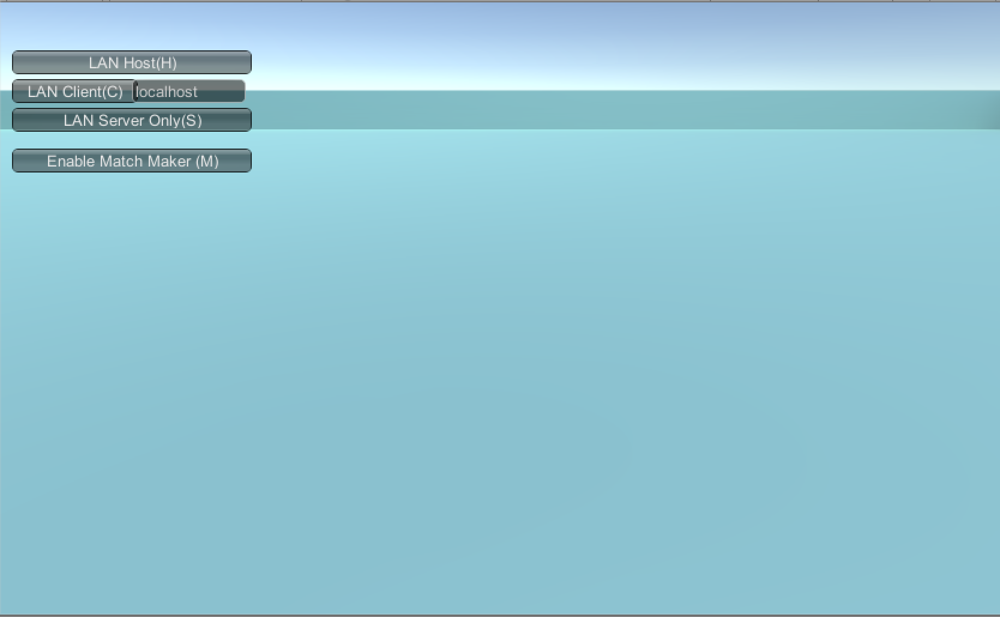

# Gameplay

## Basic Movement
* Use the arrowkeys or WASD to move.
* Press the spacebar once to jump and twice to doublejump

## Ice Blocks
* Press the N key to generate an ice block in your front-diagonal direction.
.png)
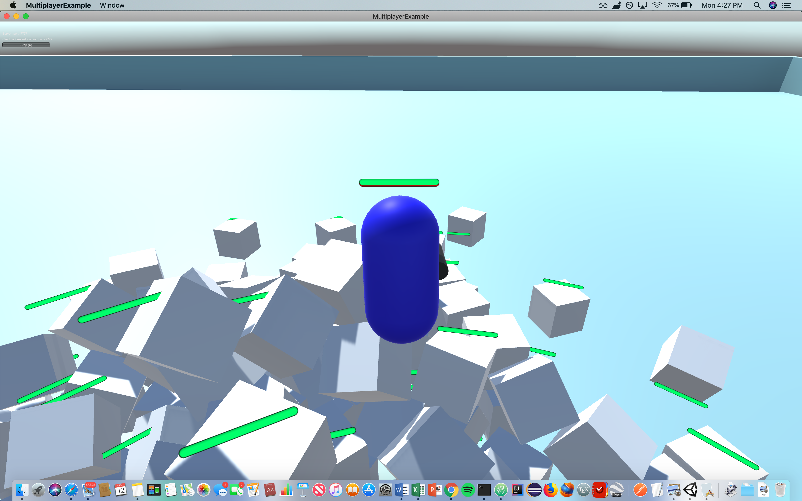

## Advanced Movement
* Move forward and left (Holding up+left or W+A) + alternate quickly between jumping and ice block spawning (N + spacebar) = Tornado Climbing, allowing you to gain elevation off the ground to dodge snowballs and evade opponents.
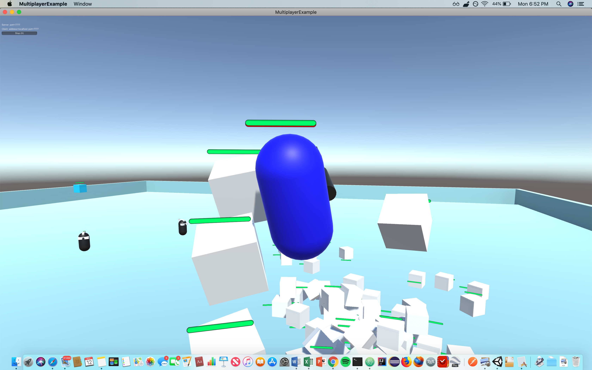

## Snowball Throwing / Healthbar
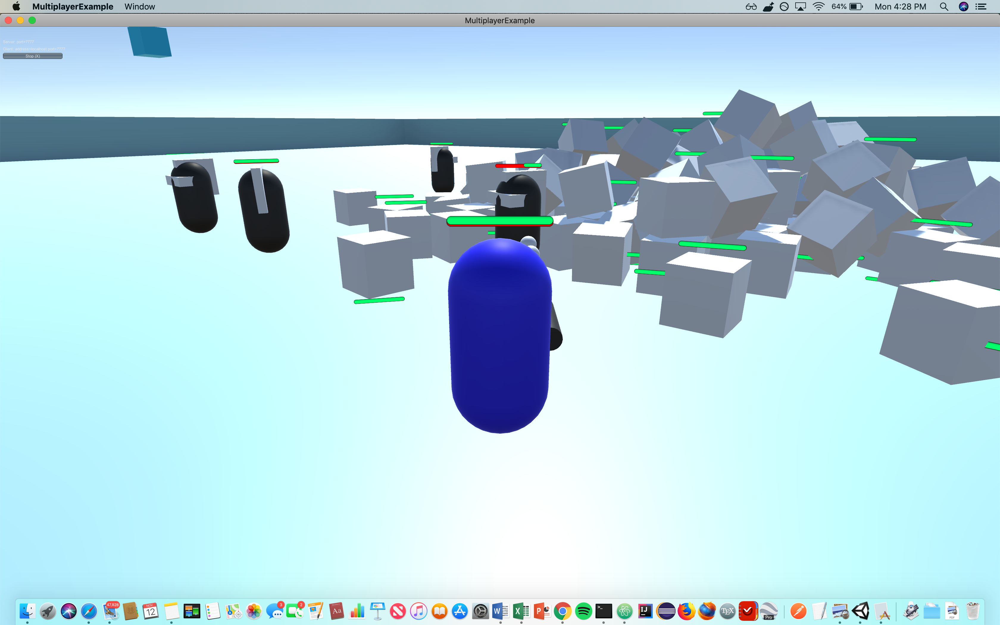

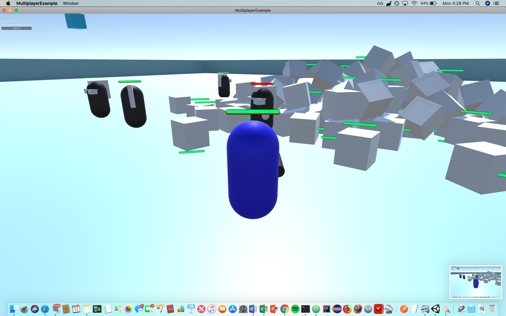
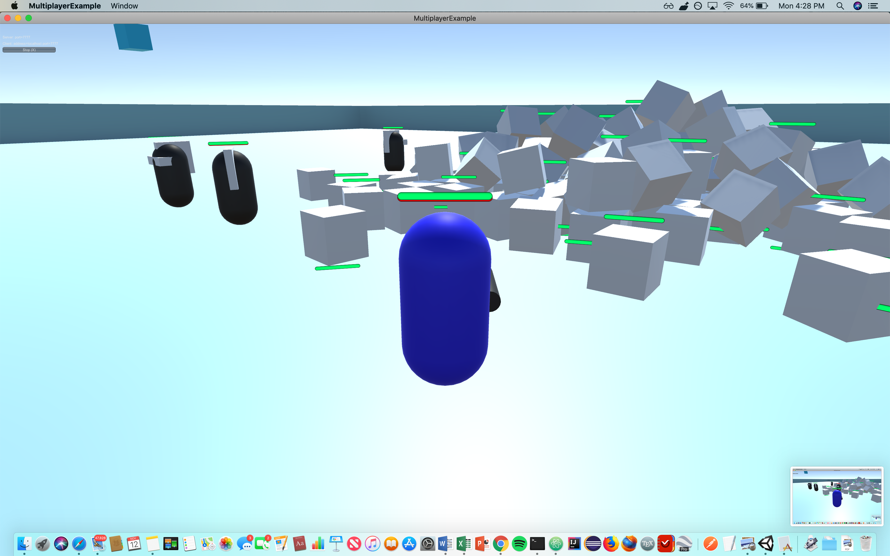

## PVP Gameplay
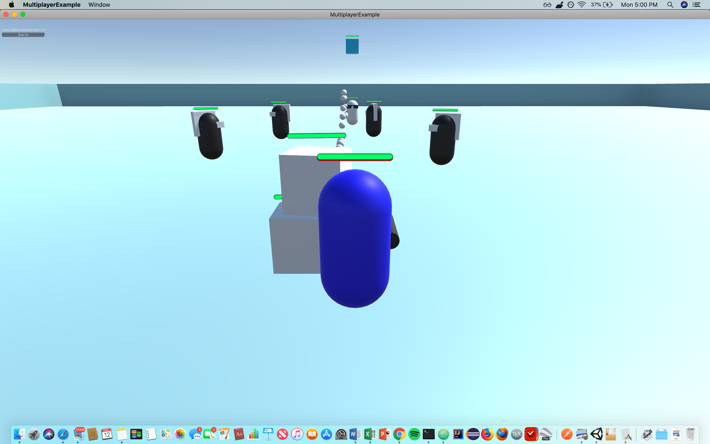
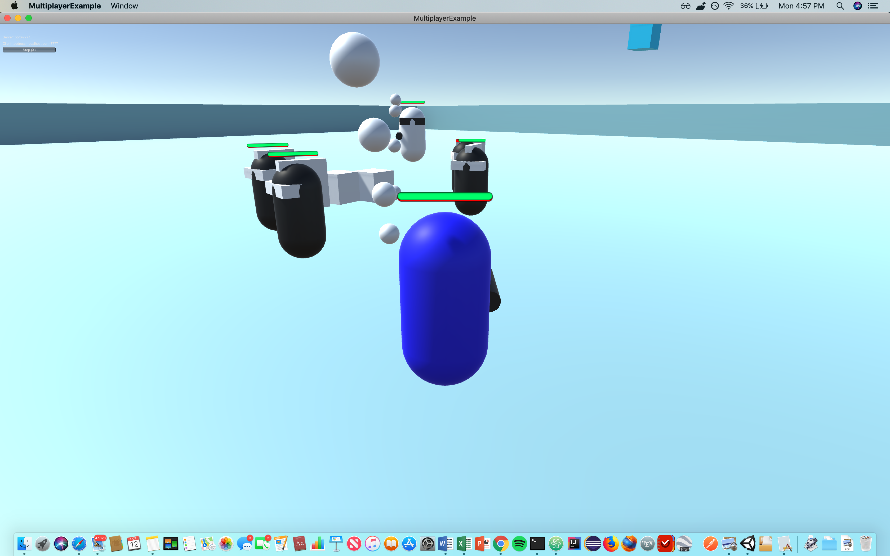
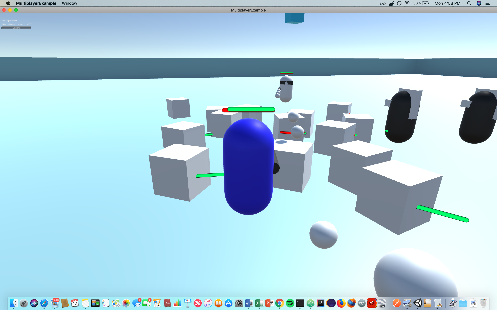
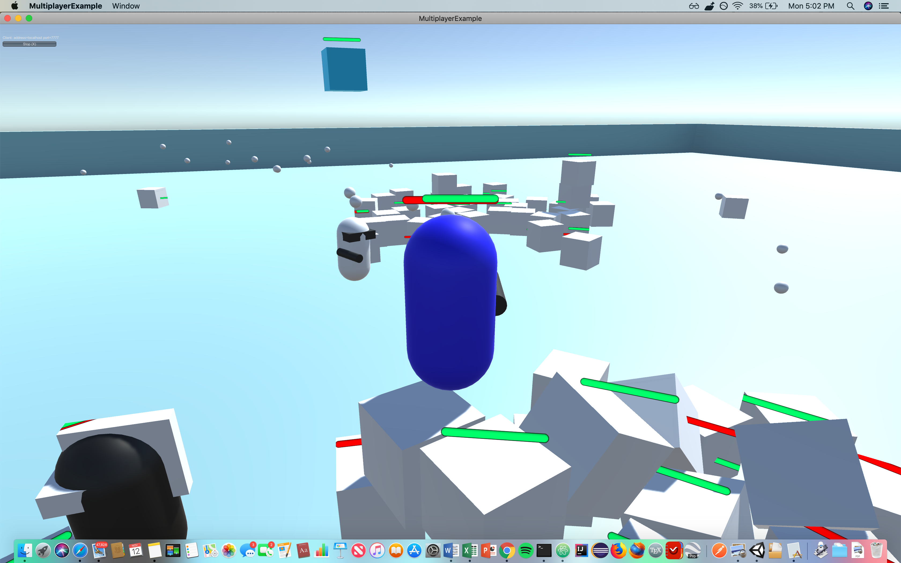
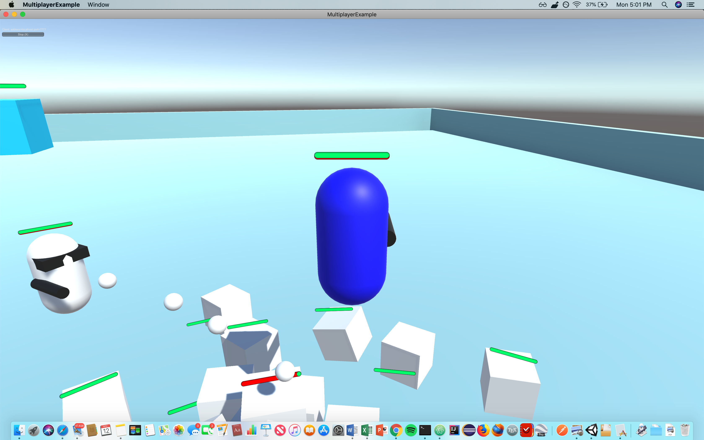
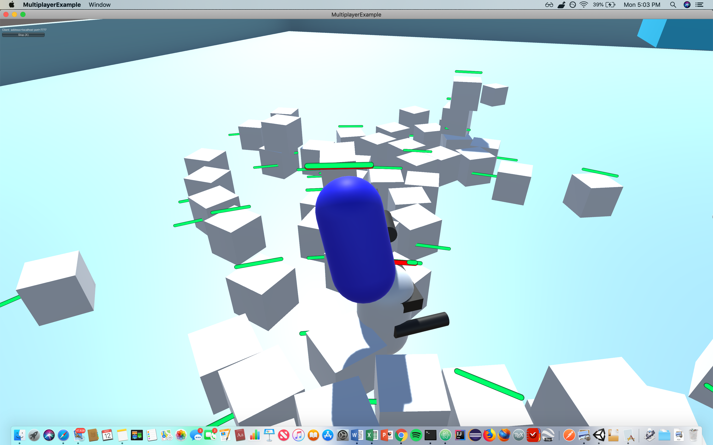
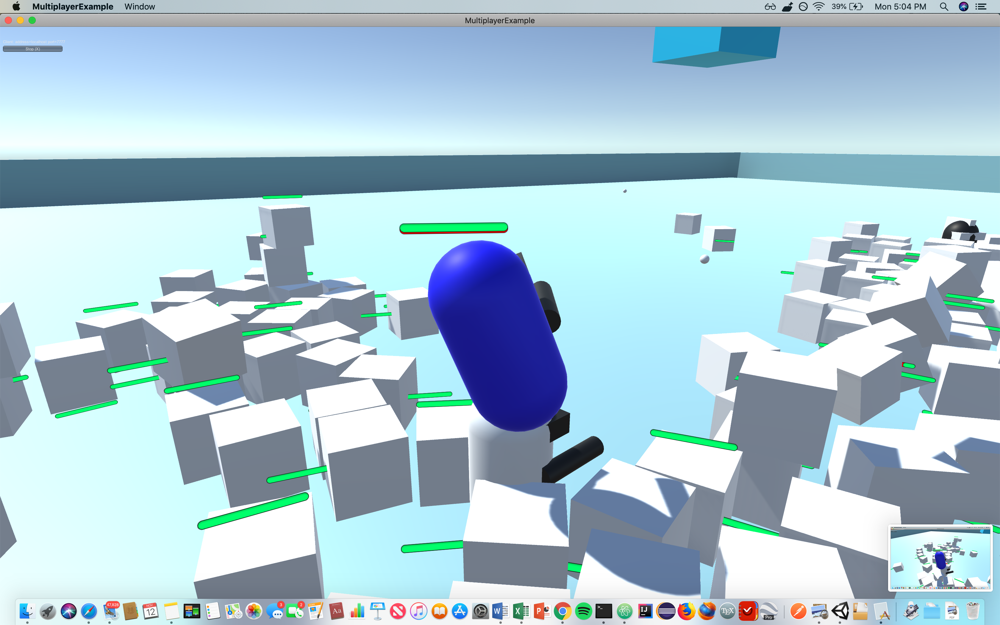

